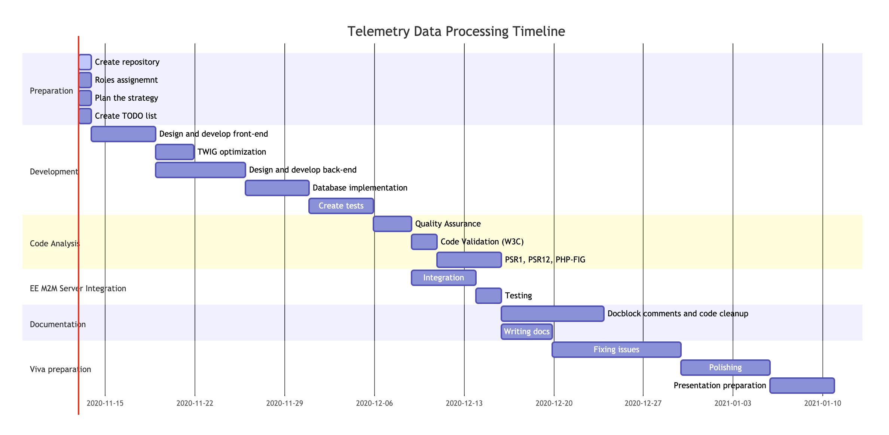

# CTEC3110 Assessment

### Project timeline

[or view here](https://mermaid-js.github.io/mermaid-live-editor/#/view/eyJjb2RlIjoiZ2FudHRcbmRhdGVGb3JtYXQgIERELU1NLVlZWVlcbnRpdGxlICAgICAgIFRlbGVtZXRyeSBEYXRhIFByb2Nlc3NpbmcgVGltZWxpbmVcblxuc2VjdGlvbiBQcmVwYXJhdGlvblxuQ3JlYXRlIHJlcG9zaXRvcnkgICAgICAgICAgICAgICAgIDphY3RpdmUsICAgIGRlczEsIDIwMjAtMTEtMTIsIDFkXG5Sb2xlcyBhc3NpZ25lbW50ICAgICAgICAgICAgICAgICAgOiAgICAgICAgICAgZGVzMiwgMjAyMC0xMS0xMiwgMWRcblBsYW4gdGhlIHN0cmF0ZWd5ICAgICAgICAgICAgICAgICA6ICAgICAgICAgICBkZXMzLCAyMDIwLTExLTEyLCAxZFxuQ3JlYXRlIFRPRE8gbGlzdCAgICAgICAgICAgICAgICAgIDogICAgICAgICAgIGRlczQsIDIwMjAtMTEtMTIsIDFkXG5cbnNlY3Rpb24gRGV2ZWxvcG1lbnRcbkRlc2lnbiBhbmQgZGV2ZWxvcCBmcm9udC1lbmQgICAgICA6IGRlczUsIGFmdGVyIGRlczQsIDVkXG5UV0lHIG9wdGltaXphdGlvbiAgICAgICAgICAgICAgICAgOiBkZXM1MSwgYWZ0ZXIgZGVzNSwgM2RcbkRlc2lnbiBhbmQgZGV2ZWxvcCBiYWNrLWVuZCAgICAgICA6IGRlczYsIGFmdGVyIGRlczUsIDdkXG5EYXRhYmFzZSBpbXBsZW1lbnRhdGlvbiAgICAgICAgICAgOiBkZXM3LCBhZnRlciBkZXM2LCA1ZFxuQ3JlYXRlIHRlc3RzICAgICAgICAgICAgICAgICAgICAgIDogZGVzOCwgYWZ0ZXIgZGVzNywgNWRcblxuc2VjdGlvbiBDb2RlIEFuYWx5c2lzXG5RdWFsaXR5IEFzc3VyYW5jZSAgICAgICAgICAgICAgICAgOmRlczksIGFmdGVyIGRlczgsIDNkXG5Db2RlIFZhbGlkYXRpb24gKFczQykgICAgICAgICAgICAgOmRlczkxLCBhZnRlciBkZXM5LCAyZFxuUFNSMSwgUFNSMTIsIFBIUC1GSUcgICAgICAgICAgICAgIDpkZXM5MiwgYWZ0ZXIgZGVzOTEsIDVkXG5cbnNlY3Rpb24gRUUgTTJNIFNlcnZlciBJbnRlZ3JhdGlvblxuSW50ZWdyYXRpb24gICAgICAgICAgICAgICAgICAgICAgIDpkZXMxMCwgYWZ0ZXIgZGVzOSwgNWRcblRlc3RpbmcgICAgICAgICAgICAgICAgICAgICAgICAgICA6ZGVzMTEsIGFmdGVyIGRlczEwLCAyZFxuXG5zZWN0aW9uIERvY3VtZW50YXRpb25cbkRvY2Jsb2NrIGNvbW1lbnRzIGFuZCBjb2RlIGNsZWFudXAgICAgICAgICAgICAgICA6ZGVzMTIsIGFmdGVyIGRlczExLCA4ZFxuV3JpdGluZyBkb2NzICAgICAgICAgICAgICAgICAgICAgICAgICAgICAgICAgICAgIDpkZXMxMywgYWZ0ZXIgZGVzMTEsIDRkXG5cbnNlY3Rpb24gVml2YSBwcmVwYXJhdGlvblxuRml4aW5nIGlzc3VlcyAgICAgICAgICAgICAgICAgICA6IGRlczE0LGFmdGVyIGRlczEzLCAxMGRcblBvbGlzaGluZyAgICAgICAgICAgICAgICAgICAgICAgOiBkZXMxNSwgYWZ0ZXIgZGVzMTQsIDdkXG5QcmVzZW50YXRpb24gcHJlcGFyYXRpb24gICAgICAgIDpkZXMxNiwgYWZ0ZXIgZGVzMTUsIDVkIiwibWVybWFpZCI6eyJ0aGVtZSI6ImRlZmF1bHQiLCJ0aGVtZVZhcmlhYmxlcyI6eyJiYWNrZ3JvdW5kIjoid2hpdGUiLCJwcmltYXJ5Q29sb3IiOiIjRUNFQ0ZGIiwic2Vjb25kYXJ5Q29sb3IiOiIjZmZmZmRlIiwidGVydGlhcnlDb2xvciI6ImhzbCg4MCwgMTAwJSwgOTYuMjc0NTA5ODAzOSUpIiwicHJpbWFyeUJvcmRlckNvbG9yIjoiaHNsKDI0MCwgNjAlLCA4Ni4yNzQ1MDk4MDM5JSkiLCJzZWNvbmRhcnlCb3JkZXJDb2xvciI6ImhzbCg2MCwgNjAlLCA4My41Mjk0MTE3NjQ3JSkiLCJ0ZXJ0aWFyeUJvcmRlckNvbG9yIjoiaHNsKDgwLCA2MCUsIDg2LjI3NDUwOTgwMzklKSIsInByaW1hcnlUZXh0Q29sb3IiOiIjMTMxMzAwIiwic2Vjb25kYXJ5VGV4dENvbG9yIjoiIzAwMDAyMSIsInRlcnRpYXJ5VGV4dENvbG9yIjoicmdiKDkuNTAwMDAwMDAwMSwgOS41MDAwMDAwMDAxLCA5LjUwMDAwMDAwMDEpIiwibGluZUNvbG9yIjoiIzMzMzMzMyIsInRleHRDb2xvciI6IiMzMzMiLCJtYWluQmtnIjoiI0VDRUNGRiIsInNlY29uZEJrZyI6IiNmZmZmZGUiLCJib3JkZXIxIjoiIzkzNzBEQiIsImJvcmRlcjIiOiIjYWFhYTMzIiwiYXJyb3doZWFkQ29sb3IiOiIjMzMzMzMzIiwiZm9udEZhbWlseSI6IlwidHJlYnVjaGV0IG1zXCIsIHZlcmRhbmEsIGFyaWFsIiwiZm9udFNpemUiOiIxNnB4IiwibGFiZWxCYWNrZ3JvdW5kIjoiI2U4ZThlOCIsIm5vZGVCa2ciOiIjRUNFQ0ZGIiwibm9kZUJvcmRlciI6IiM5MzcwREIiLCJjbHVzdGVyQmtnIjoiI2ZmZmZkZSIsImNsdXN0ZXJCb3JkZXIiOiIjYWFhYTMzIiwiZGVmYXVsdExpbmtDb2xvciI6IiMzMzMzMzMiLCJ0aXRsZUNvbG9yIjoiIzMzMyIsImVkZ2VMYWJlbEJhY2tncm91bmQiOiIjZThlOGU4IiwiYWN0b3JCb3JkZXIiOiJoc2woMjU5LjYyNjE2ODIyNDMsIDU5Ljc3NjUzNjMxMjglLCA4Ny45MDE5NjA3ODQzJSkiLCJhY3RvckJrZyI6IiNFQ0VDRkYiLCJhY3RvclRleHRDb2xvciI6ImJsYWNrIiwiYWN0b3JMaW5lQ29sb3IiOiJncmV5Iiwic2lnbmFsQ29sb3IiOiIjMzMzIiwic2lnbmFsVGV4dENvbG9yIjoiIzMzMyIsImxhYmVsQm94QmtnQ29sb3IiOiIjRUNFQ0ZGIiwibGFiZWxCb3hCb3JkZXJDb2xvciI6ImhzbCgyNTkuNjI2MTY4MjI0MywgNTkuNzc2NTM2MzEyOCUsIDg3LjkwMTk2MDc4NDMlKSIsImxhYmVsVGV4dENvbG9yIjoiYmxhY2siLCJsb29wVGV4dENvbG9yIjoiYmxhY2siLCJub3RlQm9yZGVyQ29sb3IiOiIjYWFhYTMzIiwibm90ZUJrZ0NvbG9yIjoiI2ZmZjVhZCIsIm5vdGVUZXh0Q29sb3IiOiJibGFjayIsImFjdGl2YXRpb25Cb3JkZXJDb2xvciI6IiM2NjYiLCJhY3RpdmF0aW9uQmtnQ29sb3IiOiIjZjRmNGY0Iiwic2VxdWVuY2VOdW1iZXJDb2xvciI6IndoaXRlIiwic2VjdGlvbkJrZ0NvbG9yIjoicmdiYSgxMDIsIDEwMiwgMjU1LCAwLjQ5KSIsImFsdFNlY3Rpb25Ca2dDb2xvciI6IndoaXRlIiwic2VjdGlvbkJrZ0NvbG9yMiI6IiNmZmY0MDAiLCJ0YXNrQm9yZGVyQ29sb3IiOiIjNTM0ZmJjIiwidGFza0JrZ0NvbG9yIjoiIzhhOTBkZCIsInRhc2tUZXh0TGlnaHRDb2xvciI6IndoaXRlIiwidGFza1RleHRDb2xvciI6IndoaXRlIiwidGFza1RleHREYXJrQ29sb3IiOiJibGFjayIsInRhc2tUZXh0T3V0c2lkZUNvbG9yIjoiYmxhY2siLCJ0YXNrVGV4dENsaWNrYWJsZUNvbG9yIjoiIzAwMzE2MyIsImFjdGl2ZVRhc2tCb3JkZXJDb2xvciI6IiM1MzRmYmMiLCJhY3RpdmVUYXNrQmtnQ29sb3IiOiIjYmZjN2ZmIiwiZ3JpZENvbG9yIjoibGlnaHRncmV5IiwiZG9uZVRhc2tCa2dDb2xvciI6ImxpZ2h0Z3JleSIsImRvbmVUYXNrQm9yZGVyQ29sb3IiOiJncmV5IiwiY3JpdEJvcmRlckNvbG9yIjoiI2ZmODg4OCIsImNyaXRCa2dDb2xvciI6InJlZCIsInRvZGF5TGluZUNvbG9yIjoicmVkIiwibGFiZWxDb2xvciI6ImJsYWNrIiwiZXJyb3JCa2dDb2xvciI6IiM1NTIyMjIiLCJlcnJvclRleHRDb2xvciI6IiM1NTIyMjIiLCJjbGFzc1RleHQiOiIjMTMxMzAwIiwiZmlsbFR5cGUwIjoiI0VDRUNGRiIsImZpbGxUeXBlMSI6IiNmZmZmZGUiLCJmaWxsVHlwZTIiOiJoc2woMzA0LCAxMDAlLCA5Ni4yNzQ1MDk4MDM5JSkiLCJmaWxsVHlwZTMiOiJoc2woMTI0LCAxMDAlLCA5My41Mjk0MTE3NjQ3JSkiLCJmaWxsVHlwZTQiOiJoc2woMTc2LCAxMDAlLCA5Ni4yNzQ1MDk4MDM5JSkiLCJmaWxsVHlwZTUiOiJoc2woLTQsIDEwMCUsIDkzLjUyOTQxMTc2NDclKSIsImZpbGxUeXBlNiI6ImhzbCg4LCAxMDAlLCA5Ni4yNzQ1MDk4MDM5JSkiLCJmaWxsVHlwZTciOiJoc2woMTg4LCAxMDAlLCA5My41Mjk0MTE3NjQ3JSkifX0sInVwZGF0ZUVkaXRvciI6ZmFsc2V9)

Roles:

- Team Leader - <b>Jakub Norkiewicz</b>
- Software Architect - <b>Damian Klisiewicz</b>
- Web Application Developer - <b>Bartlomiej Zakrzewski</b>
- Database Administrator (DBA) - <b>Damian Klisiewicz</b>
- Tester (eg usability testing with Selenium, Unit Testing with PHP Unit) - <b>Damian Klisiewicz</b>
- Business analyst - <b>Jakub Norkiewicz</b>
- Interface Designer - <b>Jakub Norkiewicz</b>
- Documenter (DocBlocks) - <b>Bartlomiej Zakrzewski</b>
- Coding standards compliance (PSR-1 & 12) - <b>Bartlomiej Zakrzewski</b>

The application must, as a minimum:
- [ ] Use a PHP SOAP client to download SMS messages from the M2M Connect server.
- [ ] Parse all downloaded messages.
- [ ] Validate all content.
- [ ] Store the downloaded message (content and metadata) in the database.
- [ ] Display the message content and metadata on the web-browser
- [ ] Message metadata: eg source SIM number, name, email address
- [ ] Message content: ie state of switches on the board, temperature, key-pad value, etc

A complete implementation will include the following methodologies and technologies that
have been discussed this academic year:
- [ ] Separation of Concerns Architecture & Single Point of Access
- [ ] Object Oriented PHP
- [ ] following the SOLID guidelines
- [ ] SLIM micro-framework
- [ ] TWIG template engine
- [ ] Monolog logging
- [ ] Application of security techniques and avoidance of common web application
vulnerabilities
- [ ] Unit testing and security testing
- [ ] Validated HTML 5 (using simple CSS for web-page layout/presentation)
- [ ] MySQL/MariaDb
- [ ] SOAP & WSDL file
- [ ] Docblock comments
- [ ] Consistent coding style
- [ ] following the PHP-FIG PSR-1 & PSR-12 coding standards guidelines
- [x] Use of the Subversion Version Control Server
- [ ] Validation of all web-pages at http://validator.w3.org/ - include the W3C validated
logo on your web-pages when validated.

Possible extensions to the implementation could include:
- [ ] implementation of registration and login/logout features, incorporating correct session
management.
- [ ] displaying numerical data in chart form.
- [ ] an interface to send SMS messages back to the “circuit board” containing updated
settings for the board.
- [ ] administration interface to maintain users/connection data in the database.
- [ ] logging all web-application activity.
- [ ] using AJAX and JSON (or an RSS/ATOM feed) to update the display in the browser
as new SMS reports are downloaded.
- [ ] checking message metadata (eg name/phone number) against pre-stored values, thus
avoiding duplication of stored messages.
- [ ] sending an SMS or email reporting the receipt of the new message to the user’s
connection details.
